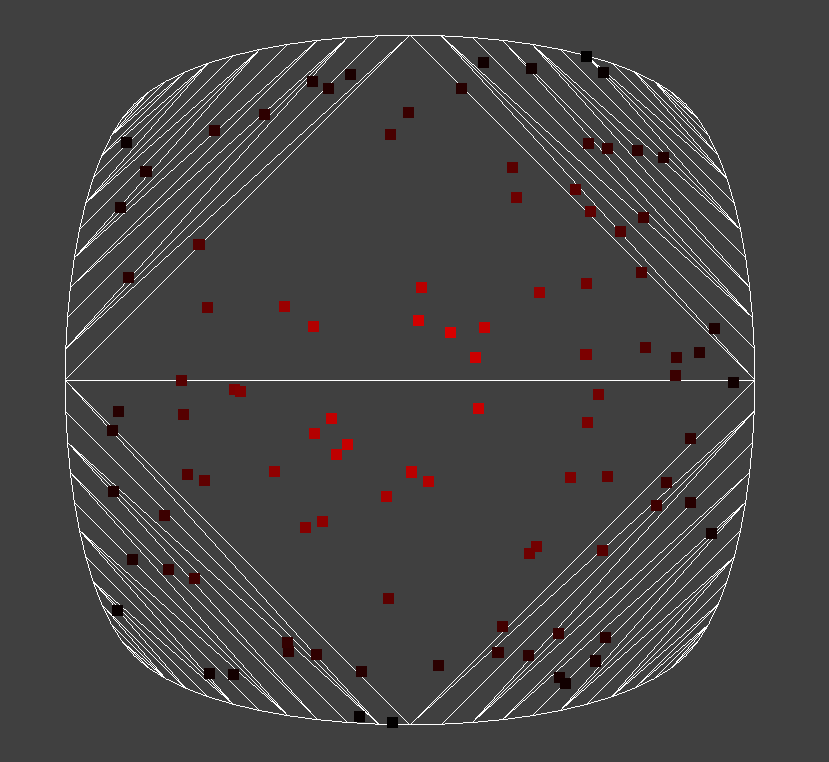

# smoothie

## C++ smooth polygon implementation

Smoothie is a C++ library that uses [splines-lib](https://github.com/andrewwillmott/splines-lib) 
and [CDT library](https://github.com/artem-ogre/CDT) to produce "smoothed" polygons,
i.e polygons which have splines instead of line segments.

## Features:
* Smoothed polygon's contour, see `Polygon::contour()`
* Smoothed polygon's triangulation, see `Polygon::dumpTriangles()`.
* Smoothed polygon's centroid, see `Polygon::computeCentroid()`.
* `Polygon::spawnRandomPoint()` returns random point inside smoothed polygon.
* `Polygon::computeClosestPoint()` returns closest point on smoothed polygon's border.

## Examples:

### Simple quad
```
    // define simple quad
    std::vector<SplineLib::Vec2f> points{
        { 0.0f, 0.0f },
        { size, 0.0f },
        { size, size },
        { 0.0f, size },
    };

    // 0.0f tensions means CatmullRom splines, -1.0f gives spherical looks.
    // For more details please read splines-lib docs.
    const auto tension = 0.0f;

    // split splines into segments of size 0.5f
    const auto segmentSize = 0.5f;
    
    // please use Vec type that suits you.
    // The type must either have x and y public fields
    // or specialisations of `smoothie::getX<Vec>` and `smoothie::getY<Vec>` must be provided.
    using Vec = glm::vec2; 

    // create smoothed polygon from the points array which represents polygon contour. 
    smoothie::Polygon<Vec> p{ points.begin(), points.end(), tension, segmentSize };

    // obtain triangles
    std::vector<Vec> vertices;
    std::vector<int> indices;
    p.dumpTriangles(std::back_inserter(vertices), std::back_inserter(indices));

    Vertex lines[6]; // your GPU Vertex format
    const auto vertex = [&vertices]() {
        return Vertex{
            vertices[index].x,
            vertices[index].y,
            // add your own attributes
        };
    };

    std::vector<Vertex> vertexBuffer;
    for (int i = 0; i < indices.size() / 3; i++) {
        lines[0] = vertex(indices[i * 3 + 0]);
        lines[1] = vertex(indices[i * 3 + 1]);

        lines[2] = vertex(indices[i * 3 + 1]);
        lines[3] = vertex(indices[i * 3 + 2]);

        lines[4] = vertex(indices[i * 3 + 2]);
        lines[5] = vertex(indices[i * 3 + 0]);
        std::copy(lines, lines + 6, std::back_inserter(vertexBuffer));
    }

    // Upload vertexBuffer to GPU and render it
```

Expected result:



### More complicated polygon with CatmullRom splines
```
    std::vector<SplineLib::Vec2f> points{
        { 0.0f, 0.0f },
        { size, 0.0f },
        { size * 0.75f, size * 0.5f },
        { size, size },
        { size * 0.5f, size },
        { size * 0.25f, size * 1.25f },
        { 0.0f, size },
        { size * 0.25f, size * 0.75f },
        { 0.0f, size * 0.5f },
        { size * 0.25f, size * 0.25f },
    };

    const float tension = 0.0f; // CatmullRom splines
    smoothie::Polygon<glm::vec2> p{ points.begin(), points.end(), tension, 0.5f };
```

Expected result:


### Same polygon with spherical splines
If tension is changed to -1 then the poly has more spherical look:
```
const float tension = -1.0f;
smoothie::Polygon<glm::vec2> p{ points.begin(), points.end(), tension, 0.5f };
```

Expected result:


###
 Spawning random points
```
    smoothie::Polygon<glm::vec2> p{ points.begin(), points.end(), tension, segmentLength };

    const auto c = p.computeCentroid();

    for (int i = 0; i < 0; i++) {
        const auto v = p.spawnRandomPoint();
        const auto t = p.computeClosestPoint(v);
        const auto distance = (t - v).length();
        const auto centroidDistance = (t - c).length();
        const auto f = std::clamp(distance / centroidDistance, 0.0f, 1.0f);
        drawQuad(v, f); // implement your own drawQuad function
    }
```

Expected result:


